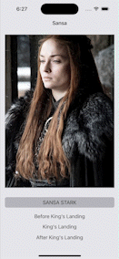

# Project 1 - MyStory

Submitted by: Sofia Toropova

MyStory is an app that introduces Sansa Stark, her story and background.

Time spent: 5 hours spent in total

## Required Features

The following **required** functionality is completed:

- [X] Users are able to see a customized app icon and launch screen
- [X] Your app should work for any screen size and orientation using AutoLayout constraints
- [X] Users are able to see at least 3 context items
- [X] Users are able to tap into each context item and see detail view contains information about each item (title, description, picture if applicable, etc.)
 
The following **optional** features are implemented:

- [X] Improve and customize the user interface through styling and coloring
- [ ] Allow users to scroll when context items are off-screen (table view implemention)

The following **additional** features are implemented:

- [X] Different color backgrounds

## App Walk-Through

## Notes

Challenges mostly resulted from AutoLayout malfunction, for example, when images were enlarged everytime a constraint was added. Some trouble with landscape orientation view.

## License

    Copyright 2023 Sofia Toropova

    Licensed under the Apache License, Version 2.0 (the "License");
    you may not use this file except in compliance with the License.
    You may obtain a copy of the License at

        http://www.apache.org/licenses/LICENSE-2.0

    Unless required by applicable law or agreed to in writing, software
    distributed under the License is distributed on an "AS IS" BASIS,
    WITHOUT WARRANTIES OR CONDITIONS OF ANY KIND, either express or implied.
    See the License for the specific language governing permissions and
    limitations under the License.